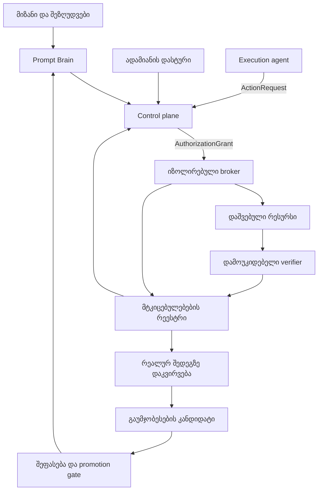

# myGO Governed AI Decision & Execution Protocol

**კერძო იმპლემენტაციის დასკვნით ეტაპზე მყოფი პროტოკოლი და PHP-ზე დაფუძნებული პლატფორმა, რომელიც რთულ მიზანს გარდაქმნის ნებადართულ მოქმედებად, დამოუკიდებლად შემოწმებულ შედეგად და გაზომვად რეალურ გამოსავლად.**

**AI მსჯელობს. პროგრამული სისტემა მართავს მდგომარეობასა და უფლებამოსილებას.**

[English](README.md) | [არქიტექტურა](docs/ARCHITECTURE.md) | [იმპლემენტაციის სტატუსი](IMPLEMENTATION-STATUS.md) | [განვითარების გეგმა](ROADMAP.md)

## რას ვაშენებთ

myGO ქმნის გადაწყვეტილებისა და შესრულების მართვად პლატფორმას ბიზნესკვლევის, პროგრამული ინჟინერიისა და ინფრასტრუქტურული ოპერაციებისთვის. პროექტი ერთ პროცესში აერთიანებს AI-ის მსჯელობას, პროგრამულად განსაზღვრულ ავტორიზაციას, სამუშაოს მდგომარეობის საიმედო შენახვასა და შედეგის დამოუკიდებელ შემოწმებას.

ტექნოლოგიური მიმართულება განსაზღვრულია: **PHP 8.4, Symfony 7.4 LTS, MariaDB/InnoDB, ზედამხედველობით გაშვებული PHP CLI workers და ცალკე იზოლირებული execution broker.** კერძო იმპლემენტაცია თითქმის დასრულებულია; პროექტის ხელმძღვანელის დადასტურებით, კომპონენტები ცალკეულადაა შემოწმებული. ინტეგრაციის ეტაპი ერთ სრულ sandbox ციკლში აერთიანებს რეალურ მოქმედებას, worker-ის შეწყვეტის შემდეგ აღდგენასა და არტეფაქტის დამოუკიდებელ შემოწმებას.

ეს რეპოზიტორი აქვეყნებს პროტოკოლს, არქიტექტურას, ინტერფეისების მაგალითებსა და განვითარების ეტაპებს. აპლიკაციის განვითარება და შემოწმება კერძო სამუშაო გარემოში მიმდინარეობს. საჯარო დოკუმენტაციის **1.1.0** ვერსია ამ განახლებას აღნიშნავს და არა production runtime-ის გამოშვებას. პროექტის მიმდინარე მდგომარეობა აღწერილია [სტატუსის დოკუმენტში](IMPLEMENTATION-STATUS.md).

## რა პრობლემას ვაგვარებთ

AI-ის მიერ შექმნილი გეგმა მოქმედების უფლებას თავისთავად არ იძლევა. დასრულებული tool call შედეგის სისწორეს არ ამტკიცებს. Worker-ის timeout კი არ გვიჩვენებს, მოასწრო თუ არა გარე სისტემამ ცვლილების შესრულება.

პროტოკოლი განსაზღვრავს, როგორ უნდა გადაწყდეს ეს საკითხები კონტრაქტებით, პროგრამული ავტორიზაციით, შენახული მდგომარეობითა და მტკიცებულებებით. მიზანია, მნიშვნელოვანი AI სამუშაო იყოს შემოწმებადი, შეზღუდული და აღდგენადი.

## ოთხი ინტელექტუალური როლი და პროგრამული მართვის ფენა

| კომპონენტი | პასუხისმგებლობა | უფლებამოსილების საზღვარი |
|---|---|---|
| **Prompt Brain** | მიზნის გააზრება, ალტერნატივების შედარება და განსაზღვრული გეგმის შეთავაზება | გეგმას სთავაზობს; საკუთარ თავს უფლებებს ვერ ანიჭებს |
| **Execution Agent** | დამტკიცებული გეგმის კონკრეტულ ActionRequest-ებად გარდაქმნა | მოქმედებას ითხოვს; broker-ს გვერდს ვერ უვლის |
| **Critic / Verifier** | არტეფაქტებისა და მტკიცებულებების შემოწმება წინასწარ დაფიქსირებული კრიტერიუმებით | მტკიცებულების ნაკლებობას PASS-ად ვერ აქცევს |
| **Learning & Improvement** | დაკვირვებული შედეგებიდან გაუმჯობესების კანდიდატების შექმნა | საკუთარ ცვლილებას stable ვერსიაში დამოუკიდებლად ვერ გადაიტანს |
| **Deterministic Control Plane** | იდენტობა, მდგომარეობა, პოლიტიკები, approvals, ბიუჯეტი და gates | პროგრამული წესებით გასცემს უფლებას და აღრიცხავს მოქმედებას |

ადრინდელ მასალებში „Astra“ შემსრულებლის როლის სახელია. ის არ ნიშნავს სავალდებულო model provider-ს ან მოქმედების დამოუკიდებელ უფლებამოსილებას.

## სამიზნე არქიტექტურა

კომპონენტებს ვერსიონირებული კონტრაქტები აკავშირებს. სამუშაოს ავტორიტეტული მდგომარეობა MariaDB-ში ინახება და არ განისაზღვრება მოდელის პასუხით ან ჩატის ისტორიით.

## სრული ციკლის ინტეგრაცია

ინტეგრაციის ეტაპი კომპონენტებს ერთ სრულ, შემოწმებად ციკლში აერთიანებს:

1. ავტორიზებული ოპერატორი UI-დან ან API-დან ქმნის run-ს.
2. პროგრამა ამოწმებს დავალებას, სამიზნეს, მიღების კრიტერიუმებსა და მოქმედების მოთხოვნას.
3. Policy ამოწმებს უფლებებს და საჭიროებისას ითხოვს ადამიანის დასტურს.
4. Broker ამოწმებს ზუსტად ავტორიზებულ მოქმედებას და რეალურად ასრულებს sandbox adapter-ს.
5. Workers ინარჩუნებს პროგრესს და შეწყვეტის შემდეგ ადგენს გაურკვეველი მოქმედების შედეგს.
6. ცალკე verifier კითხულობს მიღებულ არტეფაქტს და აფიქსირებს შემოწმების შედეგს.

| საცდელი სცენარი | აუცილებელი შედეგი |
|---|---|
| **Sandbox artifact writer** | რეგისტრირებულ workspace-ში ქმნის `output/report.json` ფაილს `status=ready` მნიშვნელობით; ცალკე მოწმდება მისი bytes და JSON შინაარსი |
| **Synthetic HTTP effect target** | ზრდის counter-ს, განზრახ წყვეტს პასუხს და reconciliation-ით აღადგენს receipt-ს იმავე მოქმედების განმეორების გარეშე |

მართვის პანელი მოიცავს ავტორიზაციას, runs-ს, tasks/events-ის ისტორიას, კონკრეტული მოქმედების approval-ს, execution/verification შედეგებსა და blocked/unknown-effect შემთხვევების განხილვას. ყველა მოქმედება რეალურ backend-სა და server-side authorization-ს უნდა უკავშირდებოდეს.

დეტალები: [პირველი ეტაპი და მიღების კრიტერიუმები](docs/FIRST-MILESTONE.md).

## პლატფორმის ძირითადი შესაძლებლობები

- **ზუსტი ავტორიზაცია:** approval უკავშირდება კონკრეტულ target-ს, operation-ს, arguments-ს, scope-სა და კონტრაქტების შესაბამის ვერსიებს. მნიშვნელოვანი ცვლილება ახალ ავტორიზაციას მოითხოვს.
- **რეალური შესრულების საზღვარი:** დაცული credentials და ქსელური წვდომა broker-ს ეკუთვნის; model worker-მა მისი გვერდის ავლით ვერ უნდა იმოქმედოს.
- **ტრანზაქციული მდგომარეობა:** state-ის ცვლილება, audit event და საჭირო job/outbox ჩანაწერი ერთ transaction-ში ინახება.
- **აღდგენა:** leases, heartbeats, fencing და შეზღუდული retries პროცესების შეფერხებისას სამუშაოს მდგომარეობას იცავს.
- **გაურკვევლობის აღრიცხვა:** `UNKNOWN_EFFECT` იწვევს reconciliation-ს; timeout თავისთავად ცვლილების გამეორების უფლებას არ იძლევა.
- **დამოუკიდებელი შემოწმება:** შედეგი ფასდება რეალური არტეფაქტითა და verifier-ის იდენტიფიცირებადი receipt-ით.
- **მოქმედი gates:** ახალი critical contradiction ან acceptance-ის ცვლილება შესაბამის ძველ gate-ს აუქმებს.
- **ბიუჯეტის კონტროლი:** ლიმიტში შედის reserved, settled და uncertain ხარჯები.
- **კონტროლირებადი გაუმჯობესება:** stable ქცევის შეცვლამდე კანდიდატი გადის შეფასებასა და promotion პროცესს.

ამ შესაძლებლობებს ავტორიზაციისა და მტკიცებულებების საერთო მოდელი აერთიანებს. კომპონენტების შემოწმება, სრული ციკლის მიღება და production დანერგვა აღირიცხება [სტატუსის დოკუმენტში](IMPLEMENTATION-STATUS.md).

## სამი განსხვავებული შედეგი

| შედეგი | კითხვა |
|---|---|
| Execution | შესრულდა მოქმედება, ჩავარდა თუ გაურკვეველი ეფექტი დატოვა? |
| Verification | აკმაყოფილებს დამოუკიდებელი მტკიცებულება წინასწარ დაფიქსირებულ კრიტერიუმებს? |
| Real-world outcome | მოგვცა ცვლილებამ სასურველი ოპერაციული ან ბიზნესშედეგი? |

ტექნიკურად წარმატებულ deployment-ს შეიძლება არასასურველი ბიზნესშედეგი მოჰყვეს. სისტემა ამ განსხვავებას ანგარიშგებისა და გაუმჯობესების პროცესშიც ინარჩუნებს.

## იმპლემენტაცია და დანერგვა

არჩეული საფუძველია PHP modular monolith და ცალკე პროცესითა და უსაფრთხოების იდენტობით გაშვებული broker. PHP core-ს მუშაობისთვის Python არ დასჭირდება. ადრინდელი Python reference runtime დარჩება შესაბამისობის fixtures-ისა და შეფასების დამხმარე რესურსად.

პირველი სამიზნეა **single-tenant, private, self-hosted** ინსტალაცია. Dedicated server, private cloud და on-premises დანერგვა შესაბამისი გარემოს acceptance-ს გაივლის. სამიზნე არქიტექტურა myGO-ის SaaS control plane-ზე სავალდებულო დამოკიდებულებას არ მოითხოვს.

მოდელებისა და tools-ის ინტერფეისები provider-neutral რჩება. გარე მოდელები, fallback providers, artifacts და telemetry ერთსა და იმავე მონაცემთა და რეგიონის პოლიტიკებს უნდა ემორჩილებოდეს. სპეციალიზებული workers დაემატება კონკრეტული საჭიროების დადასტურებისას.

დეტალები: [PHP იმპლემენტაცია](docs/PHP-NATIVE.md), [დანერგვა](docs/DEPLOYMENT.md).

## გამოყენების მიმართულებები

საერთო control architecture-ზე განვითარდება ბიზნესსტრატეგიის, პროდუქტის დაგეგმვის, პროგრამული ინჟინერიის, ინფრასტრუქტურის, უსაფრთხოების, კვლევისა და მარკეტინგის domain profiles. თითოეული მიმართულება განსაზღვრავს საკუთარ tools-ს, evidence rules-სა და შეფასების კრიტერიუმებს; დანერგვის scope ადგენს მხარდაჭერილ integrations-ს.

## დოკუმენტაცია

| თემა | დოკუმენტი |
|---|---|
| სტატუსი და მტკიცებულებები | [Implementation status](IMPLEMENTATION-STATUS.md) |
| განვითარების თანმიმდევრობა | [Roadmap](ROADMAP.md) |
| კომპონენტები და საზღვრები | [Architecture](docs/ARCHITECTURE.md) |
| პირველი სამუშაო ციკლი | [First milestone](docs/FIRST-MILESTONE.md) |
| კონტრაქტები | [Contracts](docs/CONTRACTS.md) |
| მართვა და უსაფრთხოება | [Governance](docs/GOVERNANCE.md), [Security](docs/SECURITY-ARCHITECTURE.md) |
| აღდგენა და შემოწმება | [Durable execution](docs/DURABLE-EXECUTION.md), [Verification](docs/EVIDENCE-AND-VERIFICATION.md) |
| შედეგები და გაუმჯობესება | [Outcome and improvement](docs/OUTCOME-AND-IMPROVEMENT.md) |
| კერძო დანერგვა | [Commercial](docs/COMMERCIAL.md), [FAQ](docs/FAQ.md) |
| ინტერფეისების მაგალითები | [Examples](examples/README.md) |

## საჯარო და კერძო მასალები

საჯაროდ წარმოდგენილია არქიტექტურა, მოთხოვნები, კონტრაქტების კონცეფციები და მიღების ეტაპები. კერძო source code, proprietary prompts, evaluator datasets, შიდა policies, commercial connectors, მომხმარებელთა მონაცემები და secrets ამ რეპოზიტორში არ ქვეყნდება. სრული შიდა აუდიტი და implementation handoff კერძო მასალებად რჩება.

კერძო დანერგვის შეთანხმება განსაზღვრავს workflows-ს, integrations-ს, გარემოს, acceptance evidence-სა და მხარდაჭერის პირობებს. იხილეთ [კომერციული დანერგვა](docs/COMMERCIAL.md) და [საჯარო/კერძო საზღვარი](docs/PUBLIC-PRIVATE-BOUNDARY.md).

## უსაფრთხოება და ლიცენზია

სენსიტიური აღმოჩენების გასაზიარებლად გამოიყენეთ [SECURITY.md](SECURITY.md)-ში აღწერილი კერძო კომუნიკაცია.

Copyright © 2026 myGO LLC. მასალა ქვეყნდება არსებული [დოკუმენტაციის ლიცენზიით](LICENSE). ეს რეპოზიტორი არ წარმოადგენს runtime-ის open-source გავრცელებას.
