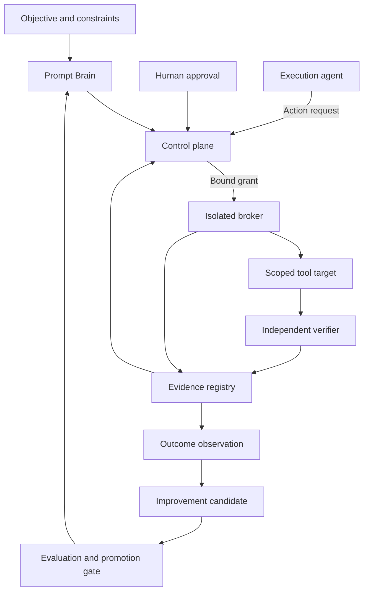

# myGO Governed AI Decision & Execution Protocol

**A protocol and PHP-native platform in advanced private development for turning complex objectives into authorized actions, independently verified results and measurable outcomes.**

**Turning probabilistic AI reasoning into governed, durable, auditable and verifiable execution.**

**Models reason. Software controls state and authority.**

[ქართული](README.ka.md) | [Architecture](docs/ARCHITECTURE.md) | [Implementation status](IMPLEMENTATION-STATUS.md) | [Roadmap](ROADMAP.md)

## What we are building

myGO is developing a governed decision and execution platform for business research, software engineering and infrastructure operations. The project brings AI reasoning, deterministic authorization, durable workflow state and independent verification into one controlled lifecycle.

The implementation foundation is defined: **PHP 8.4, Symfony 7.4 LTS, MariaDB/InnoDB, supervised PHP CLI workers and a separately isolated execution broker.** The private implementation is nearing completion, with component-level validation confirmed by the project owner. The integration milestone brings real tool execution, recovery after worker interruption and independently checked output into one complete sandbox workflow.

This repository publishes the protocol, architecture, interface examples and delivery milestones. The application is developed and validated privately. Public documentation version **1.1.0** identifies this documentation update, not a production runtime release. See [Delivery status](IMPLEMENTATION-STATUS.md).

## The problem we address

An AI-generated plan does not establish permission to act. A completed tool call does not prove that the requested result is correct. A worker timeout does not reveal whether an external change happened.

The protocol defines how these questions are resolved through explicit contracts, software-controlled authority, durable records and evidence. Its purpose is to make consequential AI work reviewable, bounded and recoverable.

## Why this is not a prompt wrapper

The protocol does not treat a model response, agent message or successful tool call as authoritative system state.

- **Authority is deterministic:** models can propose decisions and actions, but software policy, approval state and bound grants determine whether execution is permitted.
- **Workflow state is durable:** authoritative run, task, approval, budget and execution state is persisted transactionally rather than inferred from conversation history.
- **Execution is isolated:** protected credentials and mutation capability belong to a separately controlled broker, not directly to the reasoning model.
- **External effects are recoverable:** logical action identities, receipts and reconciliation distinguish a failed request from an operation whose effect is unknown.
- **Verification is independent:** an executor cannot declare its own result correct; acceptance depends on attributable evidence checked against frozen criteria.
- **Improvement is governed:** learning produces candidates that must pass evaluation and promotion gates before stable behavior changes.

The AI layer supplies probabilistic reasoning. The control plane supplies identity, authority, state transitions, evidence rules and recovery semantics. This separation is the core architectural boundary of the platform.

## Four intelligent roles, one software authority

| Component | Responsibility | Authority boundary |
|---|---|---|
| **Prompt Brain** | Understand the objective, compare alternatives and propose a bounded plan | Proposes decisions; cannot grant permissions |
| **Execution Agent** | Translate the approved plan into typed action requests | Requests actions; cannot bypass the broker |
| **Critic / Verifier** | Inspect artifacts and evidence against frozen acceptance criteria | Cannot turn missing evidence into PASS |
| **Learning & Improvement** | Derive candidate improvements from observed results | Cannot promote itself to a stable release |
| **Deterministic Control Plane** | Own identity, state, policies, approvals, budgets and gates | Authorizes and records actions through software rules |

“Astra” names an execution role in earlier project materials. It is not a required model provider or a source of execution authority.

## Target architecture

Versioned contracts connect these components. MariaDB owns authoritative workflow state; model responses and conversation history do not.

## End-to-end integration milestone

The integration milestone joins the components into one complete, testable execution cycle:

1. An authenticated operator creates a run through the UI or API.
2. Software validates the task, target, acceptance criteria and action request.
3. Policy evaluates permissions and obtains approval when required.
4. The broker checks the exact authorized action and executes a sandbox adapter.
5. Durable workers preserve progress and reconcile ambiguous effects after interruption.
6. A separate verifier reads the actual artifact and records its result.

Two concrete scenarios define acceptance:

| Scenario | Required result |
|---|---|
| **Sandbox artifact writer** | Create `output/report.json` with `status=ready` inside a registered workspace; independently verify its bytes and JSON content |
| **Synthetic HTTP effect target** | Apply a counter increment, deliberately lose the response, then recover the receipt without repeating the logical effect |

The management panel covers authentication, runs, task/event timelines, action approval, execution and verification results, and blocked or unknown-effect review. Each operator action must use real backend authorization.

See [First milestone and acceptance](docs/FIRST-MILESTONE.md).

## Core platform capabilities

- **Exact action authorization:** approval binds the target, operation, arguments, scope and relevant contract versions. Material changes require a new authorization decision.
- **Enforced execution boundary:** protected credentials and network access belong to the broker; a model worker cannot bypass it.
- **Transactional state:** state changes, audit events and required jobs/outbox records commit together.
- **Durable recovery:** leases, heartbeats, fencing and bounded retries protect workflow progress across processes.
- **Explicit ambiguity:** `UNKNOWN_EFFECT` triggers reconciliation; a timeout alone never authorizes replay of a mutation.
- **Independent verification:** checks use actual artifacts and attributable verifier receipts, not an executor's assertion of success.
- **Fresh gates:** new critical contradictions or changed acceptance inputs invalidate dependent verification gates.
- **Controlled budgets:** reserved, settled and uncertain costs count toward the applicable limit.
- **Governed improvement:** candidate changes pass evaluation and promotion controls before stable behavior changes.

These capabilities share one authority and evidence model. Component validation, integrated acceptance and production rollout are tracked in [Delivery status](IMPLEMENTATION-STATUS.md).

## Three separate results

| Result | Question |
|---|---|
| Execution | Did the operation run, fail or leave an uncertain effect? |
| Verification | Does independent evidence satisfy the frozen acceptance criteria? |
| Real-world outcome | Did the change produce the intended operational or business result? |

A successful deployment can still have a poor business outcome. The protocol preserves this distinction throughout reporting and improvement.

## Implementation and deployment

The selected foundation is a PHP modular monolith with a separate broker process and security identity. The PHP core is designed to operate without Python. The earlier Python reference runtime remains useful for compatibility fixtures and evaluation.

The initial deployment target is **single-tenant, private and self-hosted**. Dedicated servers, private cloud and on-premises installations are deployment paths subject to environment-specific acceptance. The target architecture does not require a myGO-hosted SaaS control plane.

Model and tool interfaces remain provider-neutral. External model calls, fallback providers, artifacts and telemetry must obey the same data and region policies. Specialized workers are introduced only for a demonstrated capability requirement.

See [PHP implementation](docs/PHP-NATIVE.md) and [Deployment](docs/DEPLOYMENT.md).

## Applications

The shared control architecture supports the development of domain profiles for business strategy, product decisions, software engineering, infrastructure, security, research and marketing. Each profile defines its accepted tools, evidence rules and evaluation criteria; delivery scope identifies the supported integrations.

## Documentation

| Topic | Document |
|---|---|
| Current status and evidence | [Implementation status](IMPLEMENTATION-STATUS.md) |
| Delivery sequence | [Roadmap](ROADMAP.md) |
| Components and trust boundaries | [Architecture](docs/ARCHITECTURE.md) |
| Integrated execution cycle | [First milestone](docs/FIRST-MILESTONE.md) |
| Typed interfaces | [Contracts](docs/CONTRACTS.md) |
| Authority and safety rules | [Governance](docs/GOVERNANCE.md), [Security architecture](docs/SECURITY-ARCHITECTURE.md) |
| Failure and recovery | [Durable execution](docs/DURABLE-EXECUTION.md) |
| Proof and acceptance | [Evidence and verification](docs/EVIDENCE-AND-VERIFICATION.md) |
| PHP and operations | [PHP-native](docs/PHP-NATIVE.md), [Deployment](docs/DEPLOYMENT.md) |
| Providers and integrations | [Model and tool abstraction](docs/MODEL-AND-TOOL-ABSTRACTION.md) |
| Outcomes and releases | [Outcome and improvement](docs/OUTCOME-AND-IMPROVEMENT.md) |
| Scope and engagement | [Use cases](docs/USE-CASES.md), [Commercial](docs/COMMERCIAL.md), [FAQ](docs/FAQ.md) |
| Public interfaces | [Sanitized examples](examples/README.md), [Glossary](docs/GLOSSARY.md) |

## Public and private scope

Public materials explain the architecture, obligations, contract concepts and acceptance milestones. Private source code, proprietary prompts, evaluator datasets, internal policies, commercial connectors, customer data and deployment secrets remain outside this repository. The full internal audit and implementation handoff are not public deliverables.

Private implementation engagements define the supported workflows, integrations, environment, acceptance evidence and support terms. See [Commercial deployment](docs/COMMERCIAL.md) and [Public/private boundary](docs/PUBLIC-PRIVATE-BOUNDARY.md).

## Security and license

Use the private reporting guidance in [SECURITY.md](SECURITY.md) for sensitive findings.

Copyright © 2026 myGO LLC. This is public documentation under the existing [proprietary documentation license](LICENSE), not an open-source runtime distribution.
