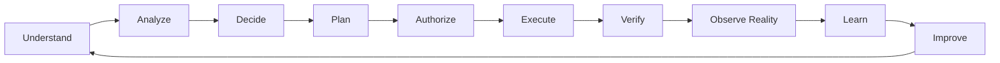
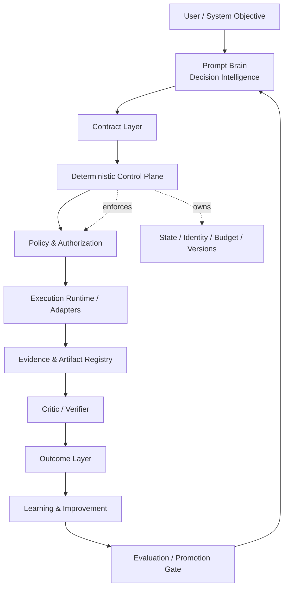

# myGO Governed AI Decision & Execution Protocol

> **Turning probabilistic AI reasoning into governed, durable, auditable and verifiable execution.**

**Models reason. Software controls state and authority.**

[](#project-status)
[](docs/PUBLIC-PRIVATE-BOUNDARY.md)
[](LICENSE)
[](docs/DEPLOYMENT.md)
[](docs/PHP-NATIVE.md)

---

## What is this?

The **myGO Governed AI Decision & Execution Protocol** is a production-oriented architecture for turning AI reasoning into controlled execution.

It is designed around a simple separation of responsibilities:

- AI models may **analyze, propose, plan and verify**.
- Deterministic software owns **state, permissions, policy, authorization and execution gates**.
- Execution produces **evidence**, not just prose.
- Verification is independent from execution.
- Real-world outcomes are tracked separately from task completion.
- Improvement is treated as **controlled release engineering**, not uncontrolled self-modification.

This repository is a **public architecture and protocol showcase**. It intentionally does **not** expose proprietary prompts, private evaluator datasets, security-sensitive policies, commercial connectors, secret deployment automation or internal improvement logic.

## Why it is not a prompt wrapper

A basic prompt wrapper is typically:

```text
User -> Prompt -> LLM API -> Response
```

This protocol targets a materially different system:

```text
User Objective
      |
      v
Decision Intelligence
      |
      v
Typed / Versioned Contracts
      |
      v
Deterministic Control Plane
      |
      v
Policy + Authorization
      |
      v
Authorized Execution
      |
      v
Evidence + Artifacts
      |
      v
Independent Verification
      |
      v
Real-World Outcome
      |
      v
Governed Improvement
```

The differentiating controls include:

- persistent deterministic state;
- machine-readable contracts;
- independent authorization;
- policy enforcement;
- durable workflows;
- capability-scoped execution;
- evidence provenance;
- versioned decisions;
- provider-neutral execution adapters;
- independent verification;
- real-world outcome feedback;
- governed self-improvement;
- regression evaluation;
- rollback;
- auditable release provenance.

## Core lifecycle



## Canonical architecture



## Five architectural responsibilities

| Layer | Responsibility | Must not do |
|---|---|---|
| **Prompt Brain** | Understand objectives, frame problems, select reasoning methods, generate alternatives and produce structured plans | Grant itself execution authority |
| **Control Plane** | Own state, policy, authorization, budgets, approvals, transitions and auditability | Become a probabilistic reasoning agent |
| **Execution Runtime** | Perform only authorized actions and produce verifiable evidence | Silently change objective, permissions or acceptance criteria |
| **Critic / Verifier** | Independently test claims, artifacts, acceptance criteria and risks | Treat inability to verify as PASS |
| **Outcome & Improvement** | Observe reality, form candidate lessons and evaluate changes before promotion | Directly overwrite stable production behavior |

## Hard governance principles

The protocol is designed around non-negotiable invariants:

1. No execution without a valid execution contract.
2. No external side effect without policy authorization.
3. No production mutation without the required approval floor.
4. No model can grant itself additional permissions.
5. No self-improvement component can promote itself directly to stable.
6. No material claim may silently lose provenance.
7. No critical state should depend only on chat history.
8. No unbounded autonomous loop.
9. No stale approval may authorize a materially changed plan.
10. No unavailable test may silently become PASS.
11. No destructive action should rely only on natural-language intent.
12. Duplicate-protection semantics should be used for external side effects where technically possible.

See [Governance & Invariants](docs/GOVERNANCE.md).

## Evidence before confidence

The protocol separates:

```text
FACT
DIRECT_OBSERVATION
EXTERNAL_EVIDENCE
VENDOR_CLAIM
MODEL_INFERENCE
ASSUMPTION
HYPOTHESIS
UNKNOWN
```

A decision should be explainable in terms of:

- what the system believed;
- what evidence supported that belief;
- what contradicted it;
- how fresh and applicable the evidence was;
- which model, prompt, policy and code versions participated;
- what new evidence later changed the belief.

See [Evidence & Verification](docs/EVIDENCE-AND-VERIFICATION.md).

## Execution success is not business success

The protocol explicitly separates:

```text
Execution Success
        !=
Verification Success
        !=
Real-World Outcome
```

A deployment can pass tests and still regress later.  
A strategy can be logically coherent and still fail in the market.  
An SEO implementation can be correct while the real search outcome remains unknown.

The **Outcome Layer** exists to preserve this distinction.

## Provider-neutral by design

Critical architecture is not intended to depend on one model vendor.

The protocol defines a **Model Gateway** concept so that Decision Intelligence, Execution Intelligence and Verification Intelligence can be configured independently by:

- provider;
- model;
- capabilities;
- structured-output support;
- tool support;
- reasoning level;
- cost;
- latency;
- availability;
- data policy;
- region;
- trust classification.

Execution is likewise adapter-oriented rather than tied to a single named agent.

## Private deployment

myGO offers private implementation and deployment engagements based on this protocol.

Supported target architectures can include:

- dedicated VPS;
- dedicated server;
- private cloud;
- on-premises;
- restricted-network environments where practical;
- single-tenant enterprise;
- hybrid model-provider access;
- customer-controlled infrastructure.

The exact implementation, integrations and security controls are agreed per deployment.

See [Deployment Models](docs/DEPLOYMENT.md).

## PHP-native private implementation

A major implementation path is **PHP-native**.

PHP-native does **not** mean implementing an AI model in PHP. It means implementing the deterministic application and control architecture naturally in a PHP environment.

A private deployment may include:

```text
PHP Web UI
PHP API
PHP Control Plane
PHP Policy Enforcement
MariaDB / MySQL
Queue / Worker System
Model Gateway
Tool Adapters
Audit / Evidence Storage
```

Where a specialized worker has a real capability advantage, Python or Node.js workers can remain optional without changing the protocol contracts.

See [PHP-native Architecture](docs/PHP-NATIVE.md).

## Example deployment modes

| Mode | Typical fit | Data/control model |
|---|---|---|
| **PHP Native** | PHP-centric organizations and private deployments | Core orchestration and control in PHP |
| **PHP + Specialized Workers** | Mixed workloads | PHP control plane with optional Python/Node workers |
| **Python Reference Runtime** | CLI, evaluation, specialized automation | Lightweight protocol-compatible runtime |
| **Private Cloud** | Enterprise | Customer-controlled network and data plane |
| **On-Premises** | Regulated / sensitive workloads | Customer infrastructure and trust boundary |
| **Hybrid** | Flexible model access | Private control plane with approved external model providers |

## Example use cases

The protocol is intentionally domain-agnostic. Domain profiles may define their own reasoning methods, risks, accepted tools, evidence rules and critic checks while sharing the same governed core.

Examples:

- business strategy and capital allocation;
- product decisions;
- software engineering;
- architecture reviews;
- infrastructure and DevOps;
- hosting and networking;
- cybersecurity;
- SEO and marketing;
- sales operations;
- research;
- data analysis;
- documentation and operational workflows.

See [Use Cases](docs/USE-CASES.md).

## Project status

**Public status: Architecture Specification / Protocol Documentation**

This repository documents the target architecture, public interfaces, governance model and commercial deployment model.

It must not be interpreted as proof that every described mechanism is already implemented in a publicly available product.

Private implementations are deployment-specific and may have a different delivery status, feature set or integration scope.

## What is public and what remains private?

### Public

- architecture principles;
- lifecycle;
- role boundaries;
- public contract concepts;
- governance model;
- evidence semantics;
- deployment patterns;
- sanitized examples;
- public security posture;
- high-level roadmap.

### Private / controlled

- proprietary prompts;
- private evaluator datasets;
- internal control policies;
- security-sensitive authorization logic;
- commercial connectors;
- deployment secrets;
- customer-specific integrations;
- proprietary improvement logic;
- production source code unless contractually provided.

See [Public / Private Boundary](docs/PUBLIC-PRIVATE-BOUNDARY.md).

## Repository map

```text
.
├── README.md
├── README.ka.md
├── LICENSE
├── SECURITY.md
├── ROADMAP.md
├── CHANGELOG.md
├── REPOSITORY-METADATA.md
├── docs/
│   ├── ARCHITECTURE.md
│   ├── GOVERNANCE.md
│   ├── CONTRACTS.md
│   ├── EVIDENCE-AND-VERIFICATION.md
│   ├── DURABLE-EXECUTION.md
│   ├── SECURITY-ARCHITECTURE.md
│   ├── MODEL-AND-TOOL-ABSTRACTION.md
│   ├── OUTCOME-AND-IMPROVEMENT.md
│   ├── PHP-NATIVE.md
│   ├── DEPLOYMENT.md
│   ├── USE-CASES.md
│   ├── PUBLIC-PRIVATE-BOUNDARY.md
│   ├── COMMERCIAL.md
│   ├── FAQ.md
│   └── GLOSSARY.md
├── examples/
│   ├── README.md
│   ├── objective-contract.example.yaml
│   ├── plan-contract.example.yaml
│   ├── authorization-grant.example.yaml
│   ├── evidence-record.example.yaml
│   ├── critic-report.example.yaml
│   └── outcome-record.example.yaml
└── .github/
    ├── ISSUE_TEMPLATE/
    │   ├── commercial-deployment.yml
    │   └── documentation-feedback.yml
    └── pull_request_template.md
```

## Commercial deployment

This public repository is not an open-source distribution of the private runtime.

For organizations that need a governed AI system adapted to their environment, myGO can provide:

- private architecture implementation;
- PHP-native control plane;
- self-hosted deployment;
- on-premises deployment;
- custom policy and approval workflows;
- model-provider integration;
- private tool adapters;
- internal knowledge integration;
- audit and evidence design;
- customer-specific domain profiles;
- migration and integration services.

See [Commercial Deployment](docs/COMMERCIAL.md).

## Security

Security-sensitive implementation details are intentionally excluded from this repository.

For responsible disclosure and security contact guidance, see [SECURITY.md](SECURITY.md).

## License

This repository is **public documentation, not open-source software**.

Copyright © 2026 myGO LLC. All rights reserved.

See [LICENSE](LICENSE).

---

### myGO Governed AI Decision & Execution Protocol

**Reason with AI. Authorize with software. Verify with evidence. Improve under governance.**
