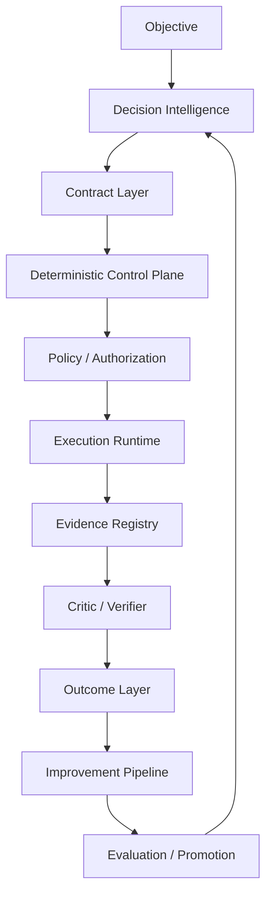
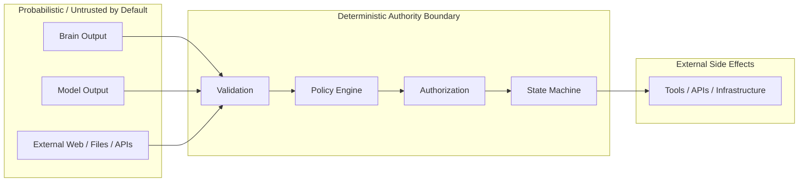

# Architecture

## Executive model

The protocol separates **reasoning** from **authority**.

AI output is treated as a proposal until it is validated by deterministic software and allowed by policy.

## Architectural roles

### Decision Intelligence

Responsible for:

- objective interpretation;
- problem framing;
- task classification;
- domain-profile selection;
- alternative generation;
- assumptions and unknowns;
- evidence requirements;
- risk analysis;
- plan generation;
- acceptance criteria;
- stop and escalation conditions.

Output must be structured enough for deterministic validation.

### Deterministic Control Plane

Owns authoritative operational state:

- run / project / tenant identity;
- workflow state;
- transitions;
- schema and semantic validation;
- permissions;
- tool and environment scope;
- approvals;
- authorization grants;
- budgets;
- iteration and timeout limits;
- retries;
- checkpoints;
- pause/resume/cancel;
- artifact/evidence registries;
- version registries;
- audit trail;
- promotion and rollback.

### Execution Runtime

Executes only authorized actions.

The runtime must not silently redefine objective, budget, permissions, risk limits, acceptance criteria or production scope.

### Critic / Verifier

Independently checks:

- factual claims;
- provenance;
- calculations;
- tests;
- artifacts;
- acceptance criteria;
- regressions;
- security implications;
- unresolved uncertainty.

### Outcome Layer

Captures what happened in reality after execution and verification.

### Improvement Pipeline

Turns observed outcomes into candidate lessons and candidate changes, then subjects them to isolated evaluation, regression, adversarial review, policy/human gates and controlled promotion.

## Trust boundaries

## Architecture objective

The protocol is optimized for reliable decision and execution under uncertainty, balancing:

- decision quality;
- execution reliability;
- verifiability;
- security;
- recoverability;
- auditability;
- extensibility;
- provider independence;
- operational simplicity;
- private deployability;
- commercial viability.
