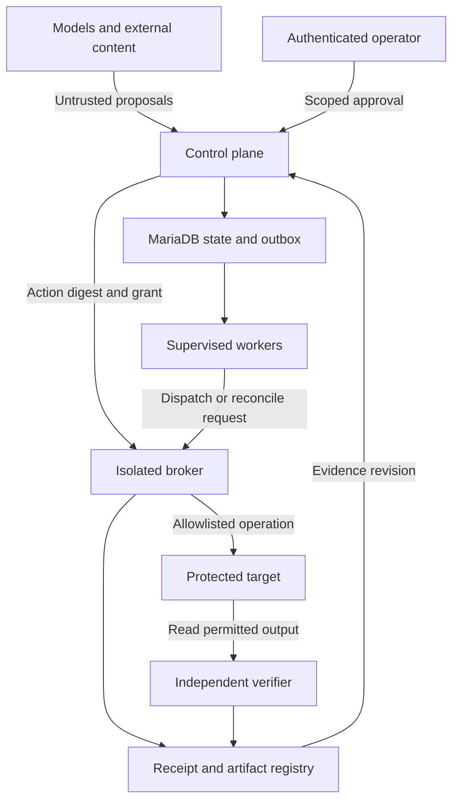

# Architecture

The selected architecture is a **PHP modular monolith, transactional MariaDB control plane, separately isolated execution broker and supervised workers**. It separates probabilistic reasoning from deterministic authority. The private implementation follows these boundaries. Delivery and validation status are tracked in [Implementation status](../IMPLEMENTATION-STATUS.md).

## Components and responsibilities

| Component | Owns | Must not own |
|---|---|---|
| Prompt Brain | Objective analysis, alternatives, bounded plan proposals | Permission issuance or canonical policy |
| Control plane | Identity, contracts, state transitions, approvals, grants, budgets, jobs and gates | Model-authored authority shortcuts |
| Execution agent | Task interpretation and typed action proposals | Direct protected-target access |
| Execution broker | Preflight, grant consumption, fixed adapter dispatch and receipts | Users, acceptance criteria or policy editing |
| Critic / Verifier | Independent artifact checks and attributable verification evidence | Executor-authored PASS or self-modified criteria |
| Outcome and improvement | Outcome observations, candidate lessons and evaluated changes | Unilateral stable promotion |

## Trust boundaries

Worker identity, filesystem permissions, network policy and credential scope must enforce this boundary. A policy mock cannot demonstrate isolation. The broker remains a trusted component whose compromise must be included in the deployment threat model.

## Contracts and authority

Versioned contracts carry tenant, project and resource scope plus immutable content references. Schema validation is followed by semantic validation of ownership, operations, environment, dependencies and acceptance coverage.

Approval binds the exact material action inputs. The broker rechecks identity, action digest, approval freshness, current policy, cancellation, budget and resource preconditions at dispatch commitment. Changed inputs cannot reuse an earlier grant.

## Persistence and process boundaries

MariaDB owns authoritative runs, tasks, actions, attempts, approvals, grants, jobs, leases, budgets, artifact metadata, verification gates, events and outbox entries. One application transaction commits the state transition and its required records.

External operations run after transaction commit. There is no global transaction with the target. Uncertain effects remain explicit until reconciliation establishes an outcome or an operator resolves a blocked case.

## Evidence and improvement

Execution, verification and real-world outcome are distinct. Checks read actual artifacts against frozen acceptance criteria. New critical evidence invalidates dependent gates and undispatched grants; dispatch and promotion recheck current revisions.

Learning produces candidates. Separate evaluation and promotion controls govern stable changes. Outcome collection and governed learning follow the first sandbox milestone in the [Roadmap](../ROADMAP.md).

## Initial scope

One private, single-tenant deployment; an authenticated operations panel; a sandbox file writer; a synthetic HTTP effect target; real multi-process recovery; and independent verification. Production adapters follow acceptance of this scope.
