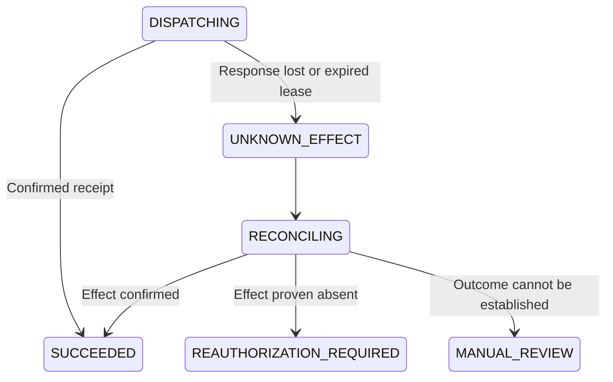

# Durable Execution and Recovery

The selected design uses MariaDB state transitions, durable jobs, leases, heartbeats, fencing and a transactional outbox. HTTP requests submit work; supervised PHP workers perform long-running tasks. These requirements are verified through parallel-process and fault-injection acceptance tests.

## Dispatch sequence

1. Claim an eligible job transactionally and advance its lease epoch.
2. Resolve the immutable action and expected target state.
3. In a final authorization transaction, recheck policy, cancellation, grant, budget and applicable gate revisions. Consume the initial grant, record the fenced attempt and commit dispatch intent.
4. Journal and execute the fixed adapter operation outside the database transaction.
5. Persist the authenticated receipt, settle the relevant budget and advance state transactionally.

State, events and required jobs/outbox entries commit together. Bounded deadlock retry may repeat a database transaction; it must not wrap and repeat the external effect.

## Ambiguous effects

These states illustrate effect recovery, not the full run state machine. A proven absent effect can proceed only through current authorization and the same logical deduplication identity.

| Condition | Required behavior |
|---|---|
| Worker dies after dispatch commitment | Reconcile before considering another mutation |
| Target confirms the effect | Store the recovered receipt without repeating it |
| Target proves the effect did not occur | Recheck policy and authorize a bounded continuation |
| Target cannot determine the effect | Manual review; no automatic mutation replay |
| Old worker returns after a new lease | Reject stale state overwrite; retain late evidence for reconciliation |
| Duplicate receipt | Same receipt is harmless; conflicting receipts are quarantined |
| Database unavailable | No new dispatch; durably preserve receipts for already-started work |

## Cancellation semantics

Cancellation committed before final dispatch commitment blocks the call. A later cancellation may leave an already committed or in-flight action running. The panel must show that uncertainty and preserve reconciliation work. Target-side cancellation or fencing is used only where the connector actually supports it.

## Duplicate protection

A single-use grant is not an exactly-once execution guarantee. Logical action identity, target idempotency, conditional updates, receipts and reconciliation work together. Connector limitations must remain visible.

The synthetic HTTP acceptance target increments once for a stable idempotency key, drops its response after applying the effect, and exposes lookup by operation ID. Recovery must find the receipt without a second increment. This demonstrates the tested target's behavior, not a universal distributed guarantee.
