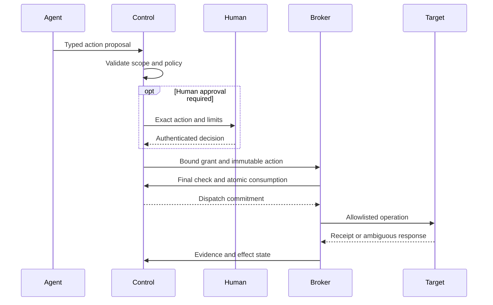

# Governance and Architectural Invariants

**Models reason. Software controls state and authority.**

The following invariants define the protocol's control model and release acceptance requirements.

## Authority

- Validate contracts and scope before execution; apply deterministic policy to every external effect.
- Bind approvals to exact material action inputs; reject changed targets or arguments.
- Enforce current policy, expiry, cancellation and budget at dispatch commitment.
- Keep protected credentials and target access behind the isolated broker.
- Prevent models from granting themselves authority or changing frozen acceptance criteria.
- Apply the same data/egress policy to reads, exports, model fallback and telemetry.

## Durable state

- Keep authoritative state in the database with legal transitions and version checks.
- Commit state, audit events and required jobs/outbox entries together.
- Reject stale worker writes through fencing; retain late evidence for reconciliation.
- Preserve unknown effects across crash, cancellation and restart.
- Reconcile ambiguous mutations before retry; do not claim universal exactly-once execution.
- Count reserved, settled and uncertain costs; bound retries, time and iterations.

## Evidence and improvement

- Retain provenance and immutable references for material claims.
- Never convert a missing check or unsupported assertion into PASS.
- Invalidate dependent gates when evidence, acceptance or critical contradictions change.
- Treat verification eligibility and production permission as separate decisions.
- Require separate evaluation and promotion for improvements; the learner cannot promote itself.
- Record rollback and compensation limitations before approving irreversible effects.

## Approval and dispatch

Cancellation before dispatch commitment blocks the operation. Later cancellation may leave an in-flight effect that still needs reconciliation. Missing authority blocks dispatch; missing evidence preserves uncertainty.
