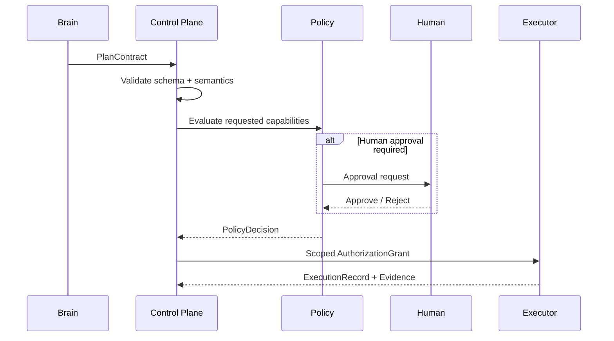

# Governance & Architectural Invariants

Governance exists to prevent probabilistic reasoning from becoming implicit authority.

## Core invariant

> **Models reason. Software controls state and authority.**

## Required invariants

1. No execution without a valid execution contract.
2. No external side effect without policy authorization.
3. No production mutation without the required approval floor.
4. No model may grant itself additional permissions.
5. No self-improvement component may directly promote itself to stable.
6. No material claim may silently lose provenance.
7. No critical state should depend only on chat history.
8. No unbounded autonomous loop.
9. No stale approval may authorize a materially changed plan.
10. No retry should duplicate an external side effect merely because the workflow repeated.
11. No unresolved evidence may silently become verified evidence.
12. No unavailable test may become PASS.
13. Credentials should be replaced with narrower delegated capabilities where practical.
14. Destructive actions must not rely only on natural-language intent.
15. External content must not automatically become trusted instruction.
16. One intelligent role must not silently rewrite another role's canonical artifacts.
17. Important releases should be attributable to source inputs, policies, model versions and code versions.
18. Important decisions should be replayable enough to explain why they occurred.
19. Expensive or irreversible operations require explicit risk classification.
20. External side effects should use idempotency or equivalent duplicate protection where technically possible.

## Governance flow

## Fail closed

When critical information, authorization or verification is missing, the safe default is to stop, block, escalate or mark uncertainty explicitly rather than silently continue.
