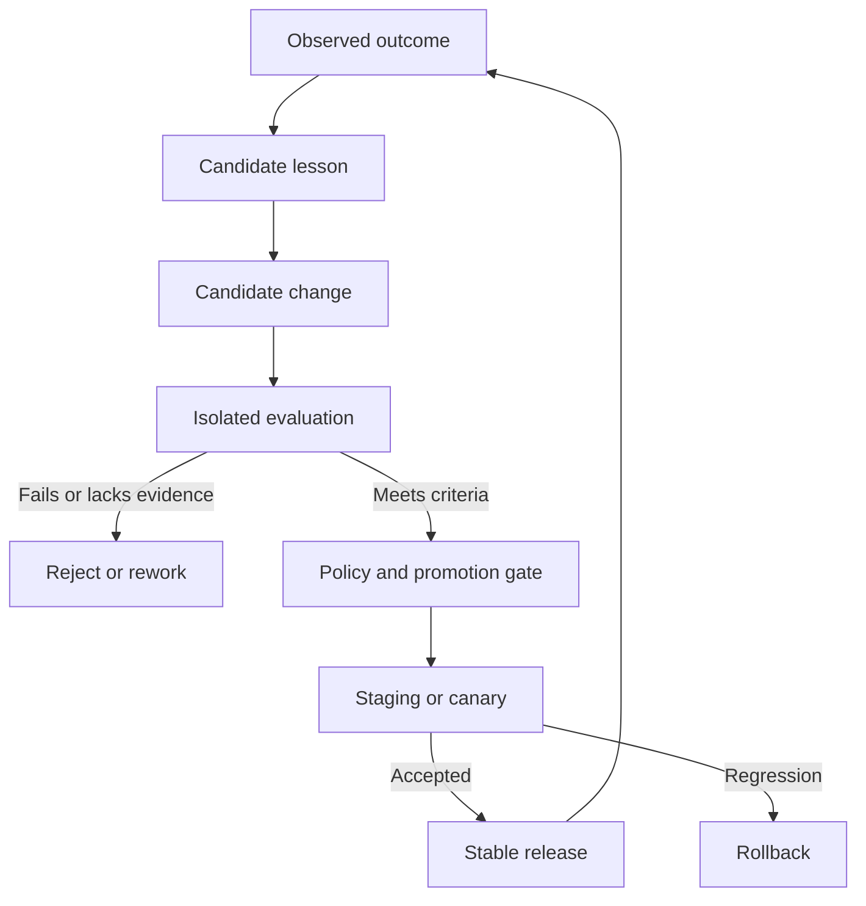

# Outcome and Governed Improvement

Execution, verification and real-world outcome are three independent states. A successful tool call can fail acceptance; a verified implementation can still miss its business objective.

## Outcome records

Capture the intended metric, observation window, baseline, observed result, evidence and uncertainty. Preserve attribution limits: a later improvement does not by itself establish that the AI-generated change caused it.

## Controlled improvement

Evaluation includes regression, adversarial and cost/latency checks. Learner identity cannot edit the evaluation authority or directly promote stable behavior. Promotion binds the candidate, evaluated artifacts, policy and evidence revisions; changed evidence invalidates stale eligibility.

Failed candidates leave stable behavior unchanged. Rollback and compensation limits must reflect the actual target's capabilities. Outcome-driven improvement has its own acceptance stage in the [Roadmap](../ROADMAP.md), separate from sandbox execution acceptance.
