# Outcome & Governed Improvement

## Three distinct states

```text
Execution Success
!= Verification Success
!= Real-World Outcome
```

These states must not collapse into one another.

## Outcome examples

- Code can pass tests while later production metrics reveal a regression.
- Strategy research can be coherent while customers reject the offer.
- SEO implementation can be correct while ranking impact remains unproven.
- Infrastructure deployment can pass initial checks while reliability degrades later.

## Improvement pipeline

```mermaid
flowchart LR
    O[Observed Outcome] --> L[Candidate Lesson]
    L --> LV[Lesson Verification]
    LV --> C[Candidate Change]
    C --> E[Isolated Evaluation]
    E --> R[Regression Suite]
    R --> A[Adversarial Evaluation]
    A --> K[Cost / Latency Evaluation]
    K --> V[Critic Gate]
    V --> P[Policy / Human Gate]
    P --> CR[Candidate Release]
    CR --> S[Canary / Staging]
    S --> SP[Stable Promotion]
```



A failed candidate must be allowed to lose.

Self-improvement is controlled release engineering, not autonomous self-modification.
